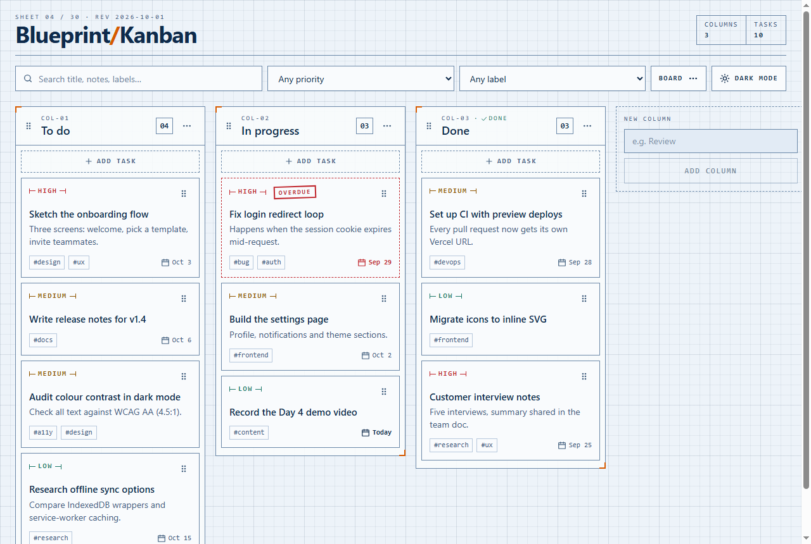
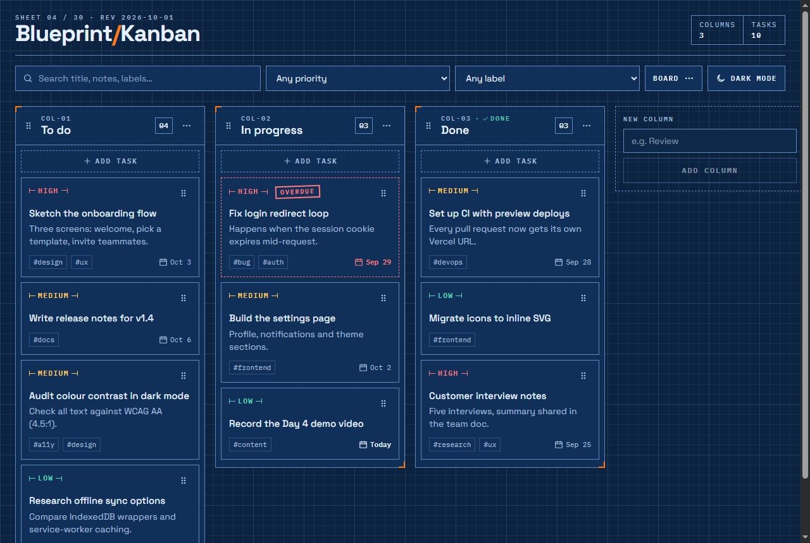

# Blueprint Kanban

**Day 4 of my 30-day development challenge.** A Kanban task board styled like a technical drawing, built to practise **complex state** (`useReducer`, context and custom hooks) and **accessible drag-and-drop** with the mouse, touch and keyboard.



<details>
<summary>Dark mode</summary>



</details>

## Features

- **Columns:** start with *To do*, *In progress* and *Done*. You can add, rename, delete (with confirmation when the column has tasks) and reorder them, by dragging or with *Move left / Move right*. Mark any column as a "done" column.
- **Tasks:** each has a title, an optional description, a priority (low/medium/high), an optional due date and labels. You add and edit them in an accessible modal.
- **Drag-and-drop:**
  - Reorder tasks within a column and move them between columns, including into empty columns.
  - Reorder whole columns.
  - Works with a **mouse, a touch screen and the keyboard**, with screen-reader announcements.
  - A dashed slot shows where the card will land, and a tilted copy follows your pointer.
- **Search and filters:** search by text and filter by priority or label. Order is never lost, and you can still drag while filtered.
- **Overdue marking:** past-due tasks get a red **OVERDUE** stamp and a dashed outline. Tasks in a "done" column are never marked overdue. Column headers show task counts (`02/07` while filtering).
- **Undo:** after deleting a task, a *Task deleted · Undo* bar appears for about 6 seconds. <kbd>Ctrl</kbd>+<kbd>Z</kbd> also works.
- **Export / import:** save the board as JSON and load it back. Imported files are validated before anything is replaced.
- **Persistence:** everything is saved to `localStorage`. Corrupted or missing data never crashes the app: it falls back to the sample board and keeps a backup of the unreadable data.
- **Light / dark theme:** the toggle is remembered, and the page never flashes the wrong theme on load.
- **Responsive** down to 360px: on phones, columns scroll horizontally and snap into place.

## Run it locally

You need Node.js 20 or newer.

```bash
npm install
npm run dev        # start the dev server at http://localhost:5173
npm run build      # production build into dist/
npm run preview    # serve the production build locally
```

**Deploying to Vercel:** import the repo and accept the defaults. Vercel detects Vite, uses `npm run build`, and serves `dist/`. No environment variables or `vercel.json` are needed.

## Using the keyboard

| Action | Keys |
|---|---|
| Pick up a task or column | Tab to its grip handle (⠿), then <kbd>Space</kbd> or <kbd>Enter</kbd> |
| Move it | <kbd>↑</kbd> <kbd>↓</kbd> within a column, <kbd>←</kbd> <kbd>→</kbd> between columns |
| Drop it | <kbd>Space</kbd> or <kbd>Enter</kbd> |
| Cancel the drag | <kbd>Esc</kbd> (everything goes back where it was) |
| Open a task | Tab to its title, then <kbd>Enter</kbd> |
| Undo a delete | <kbd>Ctrl</kbd>+<kbd>Z</kbd> (<kbd>⌘</kbd>+<kbd>Z</kbd> on a Mac), or the Undo button |

There are also ways to move things without dragging at all: the **Column** field in the task editor, and **Move left / Move right** in each column's menu.

## How it works

### State: one reducer, normalised data

All board data lives in a single reducer, [`boardReducer.js`](src/state/boardReducer.js). Components never change the board directly; they **dispatch named actions** such as `ADD_TASK`, `MOVE_TASK`, `REORDER_COLUMN` and `UNDO_DELETE`.

The data is **normalised**:

```js
{
  tasks:   { "task-1": { id, title, description, priority, dueDate, labels, createdAt } },
  columns: { "col-todo": { id, title, isDone, taskIds: ["task-1", "task-7"] } },
  columnOrder: ["col-todo", "col-doing", "col-done"]
}
```

Tasks are stored once, by id. Columns only hold an **ordered list of ids**. This makes everything else easier:

- **Moving a task** means removing an id from one array and inserting it into another. The task object is never copied.
- **Editing a task** is a single lookup, `tasks[id]`, with no searching through columns.
- **Filtering** hides ids without touching the arrays, so order is preserved for free.
- A task **can't exist twice** or drift out of sync between columns.

The reducer is **pure**. New ids and timestamps are created in small *action creators* (`boardActions.addTask(...)`) before dispatching, never inside the reducer.

### Drag-and-drop → reducer

[`useBoardDnd.js`](src/hooks/useBoardDnd.js) connects dnd-kit to the reducer. Drag events never change state themselves; they dispatch the same actions a button would:

| dnd-kit event | What happens |
|---|---|
| `onDragStart` | Snapshot the columns (needed for cancel) |
| `onDragOver` | Card entered **another** column → `MOVE_TASK` immediately, so cards make room live |
| `onDragEnd` | Final `MOVE_TASK` (reorder) or `REORDER_COLUMN` |
| `onDragCancel` / dropped outside | `RESTORE_SNAPSHOT` puts everything back |

#### Why dnd-kit and not native HTML5 drag-and-drop?

- The native API **doesn't work on most touch screens** and has **no keyboard support**.
- You can't style its drag image.
- Its events fire inconsistently over nested elements.

dnd-kit uses pointer and keyboard *sensors*, so one code path handles the mouse, touch and keyboard. It also provides `DragOverlay` and screen-reader announcements.

### Persistence that can't crash

[`usePersistedReducer`](src/hooks/useLocalStorage.js) reads storage **once**, in `useReducer`'s lazy initialiser, and writes after each change. All storage access is wrapped in `try/catch`.

Saved and imported data both pass through [`validateBoard`](src/state/validateBoard.js), which **repairs** small problems instead of throwing the whole board away:

- an unknown priority becomes `medium`;
- references to missing tasks are dropped;
- duplicate ids are removed.

## Where each concept lives

| Concept | File |
|---|---|
| Reducer with named actions | [src/state/boardReducer.js](src/state/boardReducer.js) |
| Pure action creators (ids and timestamps outside the reducer) | [src/state/boardReducer.js](src/state/boardReducer.js) (`boardActions`) |
| Normalised data shape | [src/state/boardReducer.js](src/state/boardReducer.js), [src/state/sampleData.js](src/state/sampleData.js) |
| Context provider (separate state and dispatch contexts) | [src/state/BoardContext.jsx](src/state/BoardContext.jsx) |
| UI-only context (which task is being edited) | [src/state/UIContext.jsx](src/state/UIContext.jsx) |
| Custom hook: localStorage persistence | [src/hooks/useLocalStorage.js](src/hooks/useLocalStorage.js) |
| Validating and repairing untrusted data | [src/state/validateBoard.js](src/state/validateBoard.js) |
| Drag-and-drop → reducer bridge, sensors, collision detection | [src/hooks/useBoardDnd.js](src/hooks/useBoardDnd.js) |
| Screen-reader drag announcements | [src/hooks/useBoardDnd.js](src/hooks/useBoardDnd.js) (`accessibility`) |
| Sortable task card and drag handle | [src/components/TaskCard.jsx](src/components/TaskCard.jsx) |
| Sortable column and drop container | [src/components/Column.jsx](src/components/Column.jsx) |
| `DndContext`, `DragOverlay` and the horizontal column list | [src/components/Board.jsx](src/components/Board.jsx) |
| Search and filters without losing order (`useDeferredValue`) | [src/hooks/useTaskFilters.js](src/hooks/useTaskFilters.js) |
| Undo last delete | [src/components/UndoBar.jsx](src/components/UndoBar.jsx), `UNDO_DELETE` in the reducer |
| Accessible modal (native `<dialog>`) | [src/components/Modal.jsx](src/components/Modal.jsx) |
| Task form (labels, radio group, validation) | [src/components/TaskModal.jsx](src/components/TaskModal.jsx) |
| Export / import JSON | [src/lib/boardFile.js](src/lib/boardFile.js), [src/components/BoardMenu.jsx](src/components/BoardMenu.jsx) |
| Overdue logic (timezone-safe dates) | [src/lib/dates.js](src/lib/dates.js) |
| Theme toggle with no flash | [src/hooks/useTheme.js](src/hooks/useTheme.js), inline script in [index.html](index.html) |
| Design tokens and dark mode | [src/index.css](src/index.css) (`@theme` and `[data-theme="dark"]`) |

## Project structure

```
src/
  state/       reducer, contexts, validation, sample data
  hooks/       useLocalStorage, useBoardDnd, useTaskFilters, useTheme
  lib/         dates, ids, transform, boardFile (export/import)
  components/  Board, Column, TaskCard(+View), TaskModal, Modal, ConfirmDialog,
               OptionsMenu, BoardMenu, FilterBar, UndoBar, ThemeToggle, ...
```

## Stack

- Vite + React 19 (JavaScript)
- Tailwind CSS v4 via `@tailwindcss/vite`
- [@dnd-kit/core](https://dndkit.com) + [@dnd-kit/sortable](https://docs.dndkit.com/presets/sortable)

There are no state libraries and no UI kits.

## Ideas for later

These are deliberately not built today:

- multiple boards
- subtasks and checklists
- WIP limits per column
- full undo/redo history for every action
- recurring tasks
- syncing to a backend
- unit tests for the reducer, which is pure and easy to test
